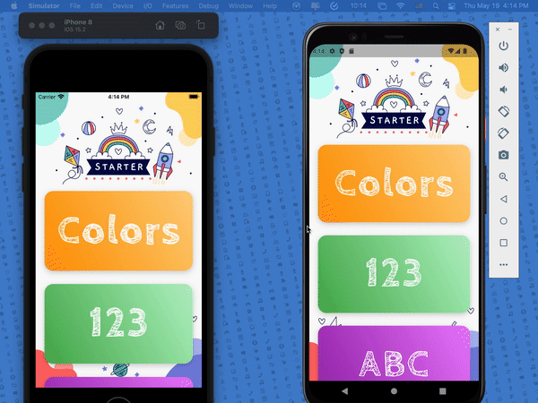

&nbsp;&nbsp;
&nbsp;&nbsp;
<a href="https://choosealicense.com/licenses/mit/" target="_blank"></a>&nbsp;&nbsp;
&nbsp;&nbsp;


# Kid Starter

</img>
This application is an updated version of "[flutter_kid_starter](https://github.com/quangrau/flutter_kid_starter)" from - QuangRau. I am using the latest Flutter 3.0 SDK, to update this awesome open-source application.<br>
Since it's an open-source project, the source code is governed by an MIT-style license that can be found in the LICENSE file or at <a href = "https://choosealicense.com/licenses/mit/">MIT LICENSE Info.</a>

## Packages Used

This application is using one third-party package from the open-source community. Thanks to the developers of <a href = "https://pub.dev/packages/just_audio">just_audio: ^0.9.24 </a> for this amazing package. The purpose of using this package is to play audio files in the flutter application. It's a <a href = "https://docs.flutter.dev/development/packages-and-plugins/favorites">Flutter Favorite</a> package.<br>
In addition to the package, for accurate `color` pronunciation, the audio files are from <a href = "https://www.macmillandictionary.com/">macmillan dictionary</a>.

```
  just_audio: ^0.9.24   //For playing audio files
```

 <p align="center">
    <a href="https://drive.google.com/file/d/19eJZsr0iSXUbuKd6pZLurC1zwUqFAPXY/view?usp=sharing" target="_blank"></img></a>
  </p>

## App Demo

<p align="center"></p>

## Tasks for the contributors
```
  1. Stories
  2. Shapes 
  3. Bangla (অ আ ক খ)
  4. Bangla (১ ২ ৩)
  5. If you have problem with understanding the code, 
     then just edit the README.md file
```

## File Pattern Inside The `lib` Folder

```
lib/
├── app/
│   ├── controllers/
│   │   ├── alphabet_en_controller.dart
│   │   ├── color_controller.dart
│   │   └── numeric_en_controller.dart
│   ├── models/
│   │   ├── alphabet_en_model.dart
│   │   ├── color_model.dart
│   │   └── numeric_en_model.dart
│   ├── screens/
│   │   ├── alphabet_en_screen.dart
│   │   ├── color_screen.dart
│   │   ├── home_screen.dart
│   │   ├── numeric_en_screen.dart
│   │   ├── shape_screen.dart
│   │   └── story_screen.dart
│   ├── widgets/
│   │   ├── category_card.dart
│   │   ├── page_header.dart
│   │   └── tile_card.dart
│   ├── constant.dart
│   └── splash_screen.dart
├── generated_plugin_registrant.dart
└── main.dart
```
